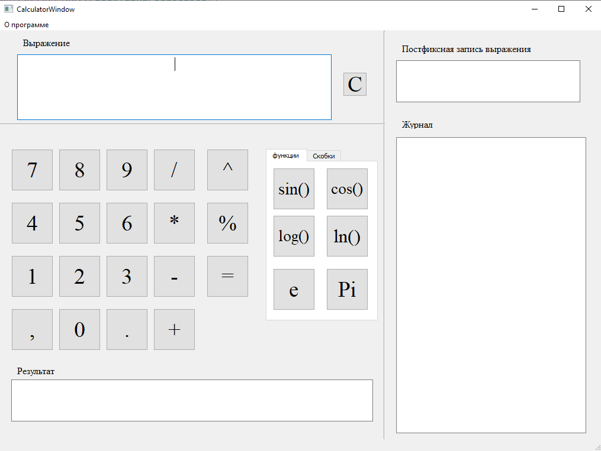
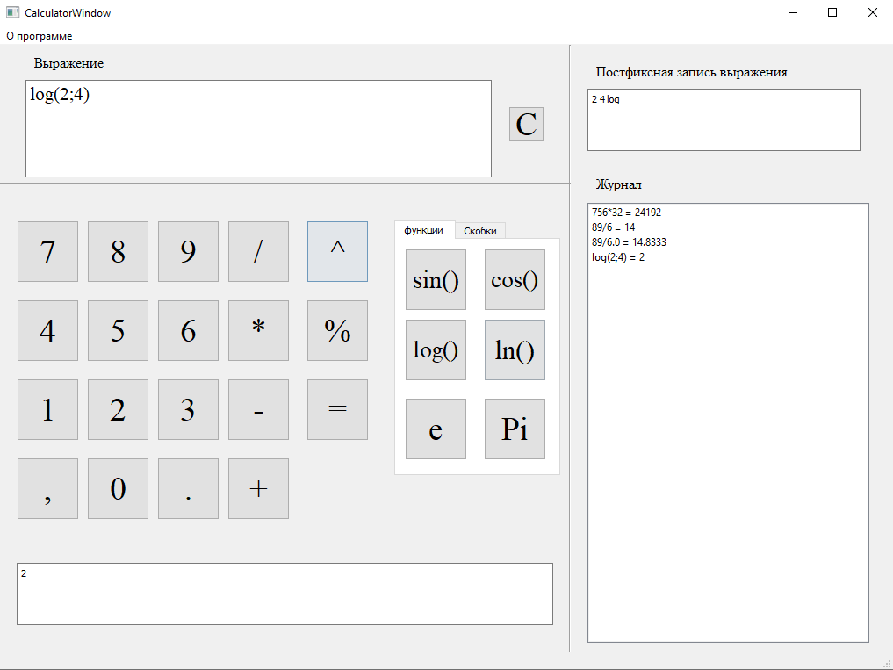

# CalculatorQt
The calculator is capable of performing simple operations and trigonometric. Stores the history of calculations and displays the postfix representation of expressions

Documentation(Doxywizard): https://catonearth.github.io/CalculatorQt/html

    Screenshot main windows:  

    

    

